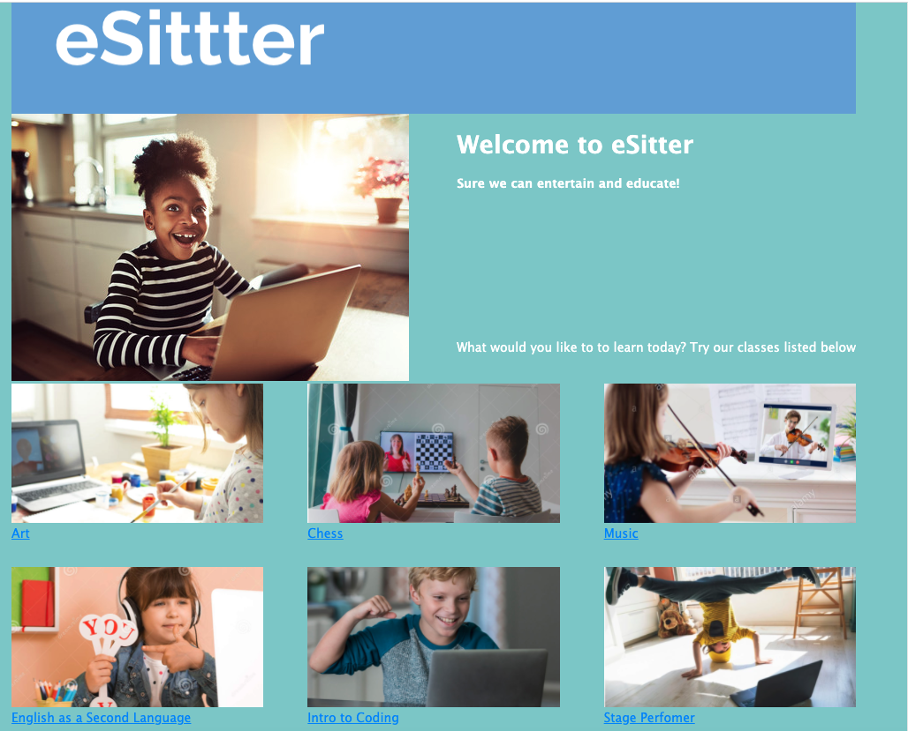
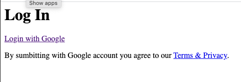
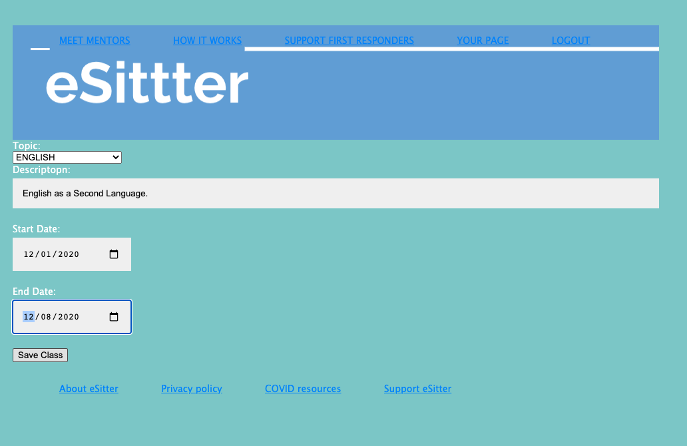
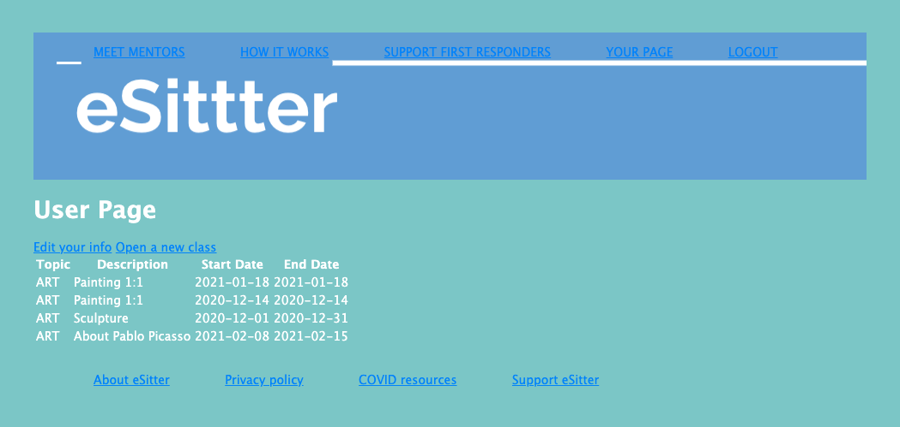
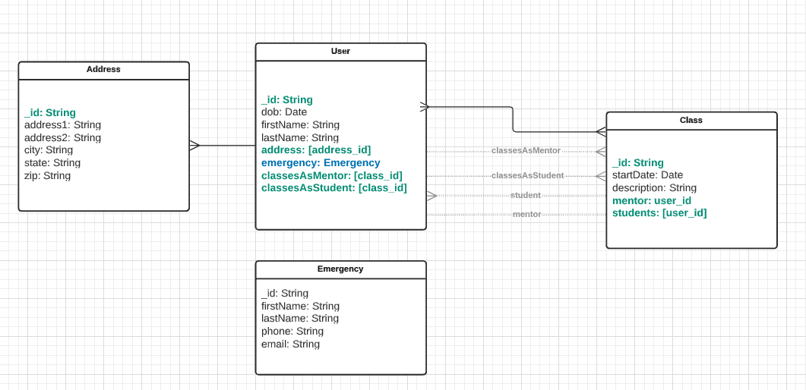

# eSitter
==================

As a part of SEI-10-19 Project 2, I created **eSitter**. 

**eSitter** is an education platform that gathering talented young individuals, inspiring each other in educational entertainment manner.

As the **COVID-19** emergency evolves and directly impacts first responders across all over the nation, we want to support our first responders and their families so they could focus on important public safety duties. 

**eSitter** will keep your child busy and entertained. 

1. Screenshots

2. Technologies Used

* HTML
* CSS 
* Javascript
* Node.JS
* Express
* Mongoose
* Heroku
* 

3. Getting Started

I utilize Trello and set a key milestones for the project.
[Trello Board](https://trello.com/b/g1sYLjTs/sei-10-19-project-2-esitter)

# Link to deployed app:
Please see the project here [eSitter](https://esitter.herokuapp.com)

Ice-BOX: 

* Integreate Google Maps;
* Implements Messages Functionality
* Add Calendar with Scheduled Classes 
* Integreate Yelp API